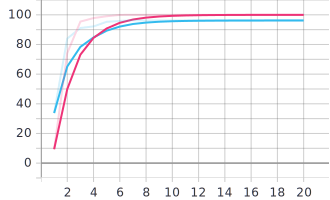
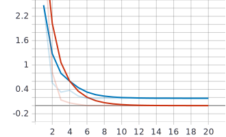

# Image classification

Image of fruits and vegetables classification using CNN.

## CNN
The CNN used is inspired from an AlexNet architecture in which I made few adjustements due to the size of the images. Dropout regularization is also added in the classifier.

### Training
I trained the network on the "Fruits 360" data set (https://www.kaggle.com/moltean/fruits, Horea Muresan, Mihai Oltean, Fruit recognition from images using deep learning, Acta Univ. Sapientiae, Informatica Vol. 10, Issue 1, pp. 26-42, 2018).

Accuracy (training : red, validation : blue) :

Loss (CrossEntropy) (training : red, validation : blue) :

(Graphs from tensorboard)

It reaches 96.19% of accuracy and a loss of 0.1811 on the validation set.

## Further ideas
- Get images from webcam.
- Use blob detection to pre-process the image in order to follow the same pattern that is used in the dataset (white background around the object).
- Classifiy it.
